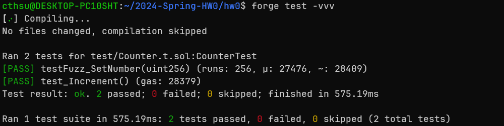
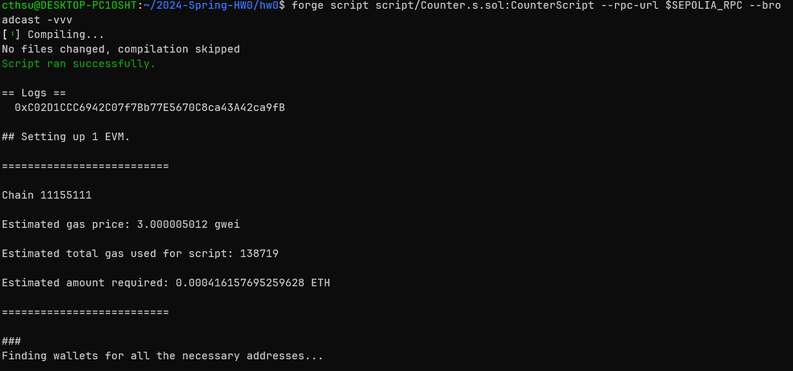
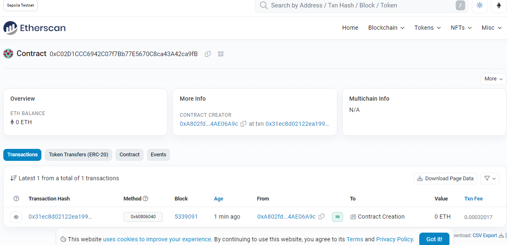

# 2024-Spring-HW0

All the detailed specified in Homework 0 documentation.

## Wallet Address
Please provide your MetaMask wallet address:
0xA802fd50F277C95d44C403738B1539004AE06A9c
## Local Testing
Please provide a screenshot of the `forge test -vvv` command running in your local environment.

## Contract Address
Please provide the contract address that you deployed on the Sepolia network.
0xC02D1CCC6942C07f7Bb77E5670C8ca43A42ca9fB

## Sepolia Etherscan
Paste the contract address into the Sepolia Etherscan and share the screenshot.
